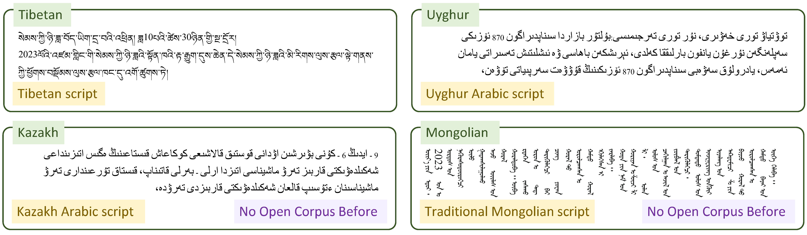

# MC^2: Towards Transparent and Culturally-Aware NLP for Minority Languages in China

📑 [**Paper**](https://arxiv.org/abs/2311.08348) 🌐 [**Project Website**](https://luciusssss.github.io/proj/mc2.html) 📊 [**Data**](https://huggingface.co/datasets/pkupie/mc2_corpus)  

🤖 [**Model (MC^2XLMR-large)**](https://huggingface.co/pkupie/mc2-xlmr-large) 🤖[**Model (MC^2Llama-13B)**](https://huggingface.co/pkupie/mc2-llama-13b)



Current large language models demonstrate deficiencies in understanding low-resource languages, particularly the minority languages in China. This limitation stems from the scarcity of available pre-training data.

To address this accessibility gap, we present **MC^2**, a **M**ultilingual **C**orpus of **M**inority **L**anguages in China, which is the largest open-source corpus of its kind so far. It encompasses four underrepresented languages: Tibetan, Uyghur, Kazakh (in the Kazakh Arabic script), and Mongolian (in the traditional Mongolian script).

* **Underrepresented Scripts**: MC^2 focuses on the less common writing systems of Kazakh and Mongolian, i.e., Kazakh Arabic script and traditional Mongolian script, which have been long neglected in previous corpus construction efforts.
* **Quality-Centric Collection**: Recognizing the prevalence of language contamination within existing corpora, we adopt a quality-centric solution for collecting MC^2, prioritizing accuracy while enhancing diversity.
* **Cultural Awareness**: Through geo-cultural probing, We underscore the importance of attending to the multiplicity of writing systems, which is closely related to the cultural awareness of the resulting models.
* **Open Access**: The MC^2 corpus and related models are made public to the community. The models trained with MC^2 perform comparably to those trained with closed-source corpora.


Read our paper for more information:
[MC^2: Towards Transparent and Culturally-Aware NLP for Minority Languages in China](https://arxiv.org/abs/2311.08348) (ACL 2024).


## Languages and Sizes

There are four minority languages in the dataset, and we report the dataset sizes below:

|                             | MC^2 (crawl) | MC^2 (full) |
| --------------------------- | ------------ | ----------- |
| **Tibetan**                 | 1.7G         | 2.2G        |
| **Uyghur**                  | 520M         | 736M        |
| **Kazakh (Arabic)**         | 397M         | 937M        |
| **Mongolian (Traditional)** | 970M         | 970M        |

MC^2 (crawl) denotes the subset of our newly-collected web crawls. MC^2 (full) is the complete set of MC^2, which additionally contains texts collected from existing resources.

**Update (JUN 3, 2024):** 
The Mongolian subset is updated with a larger size (from 874M in `mn-crawl-only-release-20231112.jsonl` to 970M in `mn-crawl-only-release-20231127.jsonl`).

## Dataset Structure

The dataset is in JSON format, with each line containing one entry with three keys: `title`, `text`, and `url`.

This is an example:

```
{
  "title":"پارتيانىڭ مەملەكەتتىك 19 - قۇرىلتايىنىڭ ورىنباسار باس حاتشىلارى",
  "text":"ليۋ چيباۋ، مىڭ جيانجۋ، جاۋ لىجي، لي جانشۋ\n\n\n(شينحۋا اگەنتتىگىنىڭ 17 - قازاندا بەيجيڭنەن بەرگەن حابارى)",
  "url":"kazakh.altxw.com\/system\/2017\/10\/24\/030007713.shtml"
}
```

## How to Obtain the Data

Our data mainly contains three parts.

You can download our web-crawled data from [Hugging Face](https://huggingface.co/datasets/pkupie/mc2_corpus).

For data from CulturaX and Wikipedia, you can download and then process them using scripts in this repository:

For data from [CulturaX](https://huggingface.co/datasets/uonlp/CulturaX), run `scripts/culturax_to_json.py` with your path to the original `.parquet` file and sha256 file and language type:

```python
python culturax_to_json.py \
  --data_dir path/to/culturax/parquet/file \
  --sha256_dir path/to/sha256/file \
  --language kk
```

`scripts/sha256.json` contains the hash values needed to filter or extract data of Uyghur language and Kazakh language from the origin CulturaX Uyghur data.

For data from [Wikipedia](https://huggingface.co/datasets/graelo/wikipedia), run `scripts/wiki_to_json.py` with your path to the original `.parquet` file and language type:

```python
python wiki_to_json.py \
  --data_dir path/to/wikipedia/parquet/file \
  --language kk
```


## Pre-trained Models

We provide two models pre-trained on MC^2.
Please read the paper for detailed information on model training.

- [MC^2XLMR-large](https://huggingface.co/pkupie/mc2-xlmr-large): XLM-RoBERTa-large continually pretrained on MC^2
- [MC^2Llama-13B](https://huggingface.co/pkupie/mc2-llama-13b): Llama2-13b continually pretrained on Chinese corpora and MC^2


## License

We released the data under the [Creative Commons CC0 license](http://creativecommons.org/publicdomain/zero/1.0/).

```
These data are released under this licensing scheme:
We do not own any of the text from which these data have been extracted.
We license the data under the Creative Commons CC0 license ("no rights reserved") http://creativecommons.org/publicdomain/zero/1.0/.
To the extent possible under law, Peking University has waived all copyright and related or neighboring rights to MC^2.

Should you consider that our data contains material that is owned by you and should therefore not be reproduced here, please:
* Clearly identify yourself, with detailed contact data such as an address, telephone number, or email address at which you can be contacted.
* Clearly identify the copyrighted work claimed to be infringed.
* Clearly identify the material that is claimed to be infringing and information reasonably sufficient to allow us to locate the material.

We will comply with legitimate requests by removing the affected sources from the next release of the corpus.
```


## Citation

```
@article{zhang2023mc,
  title={MC\^{} 2: A Multilingual Corpus of Minority Languages in China},
  author={Zhang, Chen and Tao, Mingxu and Huang, Quzhe and Lin, Jiuheng and Chen, Zhibin and Feng, Yansong},
  journal={arXiv preprint arXiv:2311.08348},
  year={2023}
}
```

## Contributors

We thank [Chen Zhang](https://luciusssss.github.io/)\*, [Mingxu Tao](https://kobayashikanna01.github.io/)\*, [Quzhe Huang](https://andrewzhe.github.io/)\*, [Jiuheng Lin](https://github.com/Infinite-set)\*, [Zhibin Chen](https://zacharychenpk.github.io/), [Yansong Feng](https://yansongfeng.github.io/) for their contribution.

\* Equal Contribution
